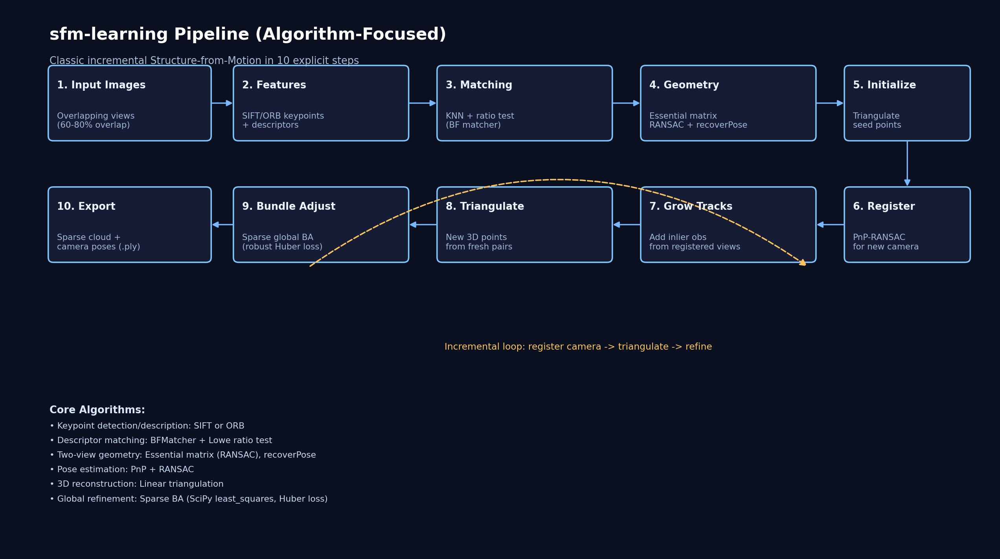

# sfm-learning: A Transparent, Incremental SfM Pipeline You Can Actually Read

If most 3D reconstruction tools feel like black boxes, `sfm-learning` is the opposite.

This project is a learning-first implementation of classic **Structure-from-Motion (SfM)**. You give it overlapping photos, and it estimates:

- camera poses for each image
- a sparse 3D point cloud of the scene

Not with magic. With explicit, inspectable geometry.



## What this project is

`sfm-learning` is intentionally scoped for clarity:

- Python + OpenCV + SciPy
- explicit pipeline stages
- minimal hidden abstraction
- easy to modify, break, and learn from

It is not trying to beat COLMAP on scale. It is trying to make SfM understandable.

## End-to-end pipeline

At a high level:

1. Detect local features
2. Match descriptors across image pairs
3. Recover initial two-view geometry
4. Initialize sparse 3D tracks
5. Incrementally register additional cameras
6. Triangulate new points
7. Refine everything with bundle adjustment
8. Export sparse reconstruction (`.ply`)

## Step 1: Feature extraction

Each image is processed with either:

- **SIFT** for more robust matching
- **ORB** for speed

Outputs per image:

- keypoints `k_i`
- descriptors `d_i`

Good features are the foundation. If this stage is weak, everything downstream gets noisy.

## Step 2: Pairwise matching

For each image pair `(i, j)`, descriptors are matched with:

- brute-force nearest neighbors
- **Lowe ratio test** to reject ambiguous matches

This yields tentative correspondences:

\[
\mathcal{M}_{ij} = \{(u_i^m, u_j^m)\}
\]

where each pair links a 2D keypoint in image `i` to one in `j`.

## Step 3: Two-view geometry for initialization

The pipeline chooses an initialization pair with strong match support and estimates:

- **Essential matrix** with RANSAC
- relative pose `(R, t)` via `recoverPose`

Conceptually:

\[
\mathbf{x}_2^\top \mathbf{E} \mathbf{x}_1 = 0
\]

RANSAC removes geometric outliers before pose recovery.

## Step 4: Seed triangulation

Using the first two camera poses and inlier correspondences, points are triangulated into 3D:

\[
\mathbf{X} = \text{triangulate}(P_1, P_2, \mathbf{x}_1, \mathbf{x}_2)
\]

Each 3D point starts as a track with observations in the two seed images.

## Step 5: Incremental camera registration

For each unregistered image, the pipeline gathers 2D-3D correspondences from existing tracks and estimates camera pose with:

- **PnP + RANSAC**

This solves:

\[
\min_{R,t} \sum_k \|\pi(K(RX_k + t)) - x_k\|^2
\]

with robust outlier rejection.

The image with the strongest inlier support is registered next.

## Step 6: Grow tracks and triangulate new points

Once a camera is registered, it can:

- attach new observations to existing tracks
- form new valid pairs with already-registered views
- triangulate additional 3D points

This is where the reconstruction expands from a seed into a scene.

## Step 7: Bundle adjustment

After incremental growth, global refinement runs via bundle adjustment (BA):

- optimize camera extrinsics and 3D point positions
- minimize reprojection error over all observations
- use robust **Huber** loss

Implemented with SciPy `least_squares`, sparse Jacobian structure, and vectorized residual evaluation for practical runtime.

## Step 8: Export

The resulting sparse model is exported as `.ply`, so you can inspect camera trajectory and structure in common 3D tools.

## Why this implementation matters

This codebase is useful because every stage maps cleanly to a canonical SfM idea:

- projective geometry
- robust estimation
- nonlinear optimization
- incremental map growth

For students and engineers, that clarity is gold.

## What to improve next

A few high-impact upgrades:

- camera intrinsics from EXIF/calibration instead of fixed heuristic focal length
- stronger track management and outlier pruning
- visualization of camera frustums
- dense reconstruction stage (MVS/meshing) downstream of sparse SfM

## Try it

```bash
sfm-learning ./data/images -o outputs/sparse.ply
```

Then open the output point cloud and inspect the reconstruction.

If you are learning SfM, this is the kind of pipeline you want: short, explicit, and faithful to the core algorithms.
